# Choose Your Hero Android App

## Why this app exists

The app is an Effective internship project.
It's also been a great and easy project to try some of the essential Android development tools on.

## What it does

The app shows a list of Marvel heroes. The data is received from [Marvel API](https://developer.marvel.com/docs#!/public/getCreatorCollection_get_0).

The main screen has a Marvel logo, a slogan and a carousel of the heroes. You can tap on the card to open the screen containing the information card (so that you can also read some tea about the hero you tapped on yay).

You can also send notifications leading the user to specific hero's information card.

The app supports caching, light/dark theme, device orientation change, edge-to-edge screen, right-to-left writing and english and russian locales.

## UI layout

The layout of the screens in both portrait and landscape orientations:

|             | Portrait                                                              | Landscape                                                            |
|-------------|-----------------------------------------------------------------------|----------------------------------------------------------------------|
| main screen | 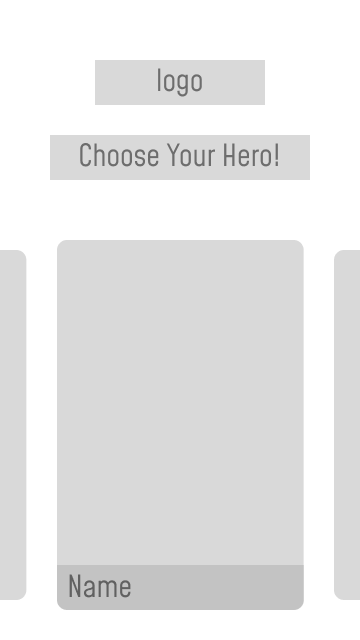   | 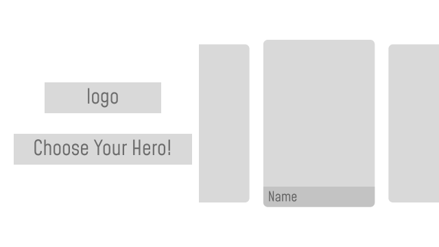  |
| info screen |  | 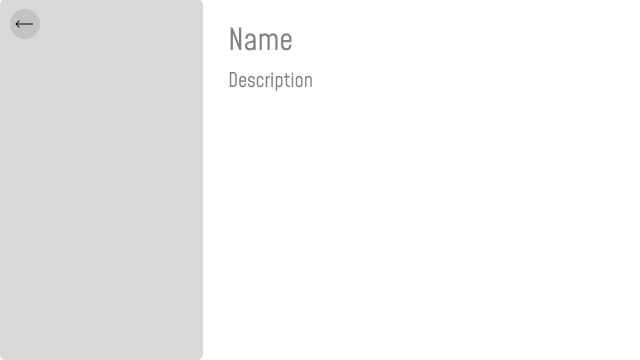 |                                                                       |

## Screenshots

The dark theme and portrait orientation:

| main screen                                               | info screen                                               |
|-----------------------------------------------------------|-----------------------------------------------------------|
| 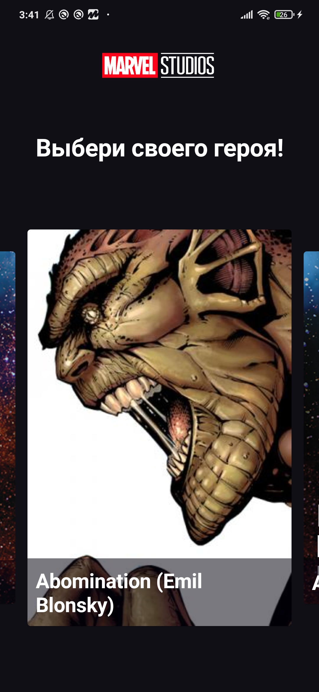 | 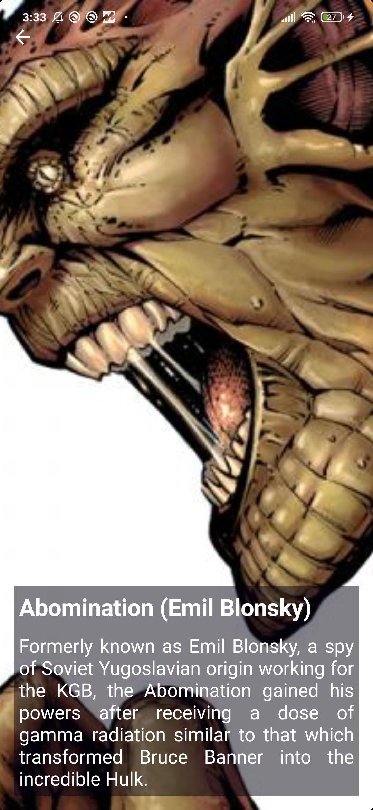 |

The light theme and landscape orientation:

| main screen                                               | info screen                                               |
|-----------------------------------------------------------|-----------------------------------------------------------|
| 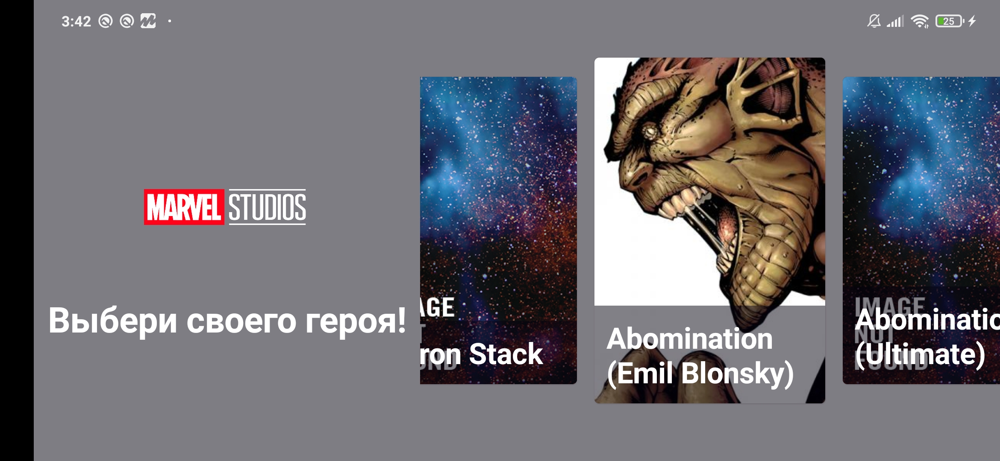 | 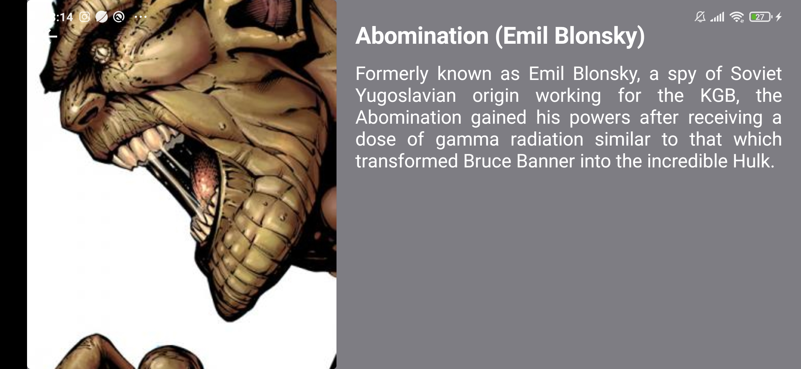 |

## Topics of labs

1. Jetpack Compose
2. Navigation
3. API Calls using Retrofit
4. Caching using Room
5. App Architecture
6. Notification using Firebase
7. Overall project additions: localization, rtl and edge-to-edge, adaptive ui support.

## How to run

0. You have to have Android Studio with Kotlin plugin installed
1. Get the Marvel API apikey and create an apikey.properties file in the root directory containing fields: 

"publicKey = ", 

"privateKey = " 

"hash = ", 

where hash equals md5 hash of timestamp(you may use just "1")+private key+public key (you better generate it online tbh)
3. Sync project with the gradle files
4. Connect your device or download an emulator
5. Run -> Run 

## How to send notifications

0. You have to have Postman installed
1. Configure Firebase and Google Cloud Services projects and add the generated google-services.json file in the app folder
2. Create a POST request in the Postman to this url: https://fcm.googleapis.com/fcm/send
3. These are the headers and the body of the request (where key equals your Server Key from FCM settings):
   | Headers | Body |
   |---------|------|
   |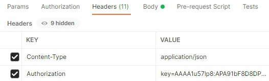|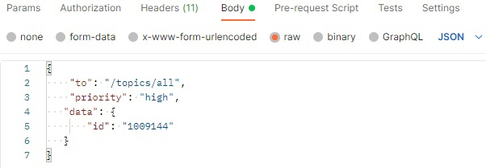|
4. If you want to get notifications with random ids, leave it as it is. If you want to get notifications with the definite id sending it via request, then do this in file PushNotificationService.kt:
   | Now | Has to be |
   |---------|------|
   |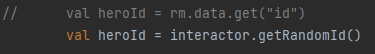|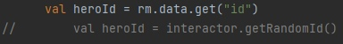|

Don't forget to look up the id's on Marvel APIs!

5. Hit the send button and you are done!

## Known issues

Snapper: Well, it's kinda off :( It doesn't let the last item in the list be the "current" one
